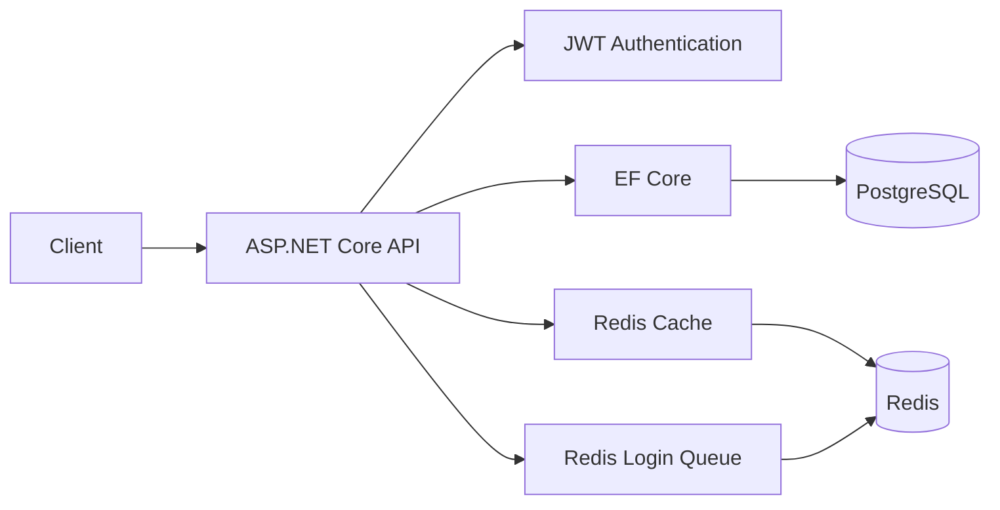

# MultiplayerBackend

A multiplayer-oriented backend and server-systems project built to explore production-style backend concerns and lower-level authoritative game-server architecture.

The repository currently contains two related tracks:

- **`MultiplayerBackend.Api`** — ASP.NET Core backend using PostgreSQL, Redis, JWT authentication, Docker Compose, health checks, and integration testing.
- **`MultiplayerBackend.GameServer`** — C++20/Linux authoritative game-server work in progress, focused on non-blocking networking, simulation timing, rollback, spatial interest management, and replication.

The ASP.NET Core backend is the primary completed portfolio slice described below.

## Backend architecture



## Engineering highlights

### Authentication and player ownership

The API supports account registration and login with ASP.NET Core password hashing and JWT bearer authentication. Authenticated player-facing endpoints derive account/player identity from token claims rather than accepting an arbitrary player ID from the client.

Relevant endpoints include:

- `POST /api/auth/register`
- `POST /api/auth/login`
- `GET /api/players/me`
- `PUT /api/players/me`

### PostgreSQL and EF Core

PostgreSQL is used for persistent account, player, and inventory state through Entity Framework Core.

The data model includes database constraints and indexes for values that need to remain unique, including usernames and per-player inventory item names.

Inventory rows use optimistic concurrency through an EF Core row-version property backed by PostgreSQL. Item transfers return a conflict result if another write changes the inventory during the operation rather than silently overwriting concurrent state.

### Redis cache-aside player reads

`GET /api/players/me` uses Redis as a distributed cache in front of PostgreSQL:

1. Check Redis for the player response.
2. On a miss, query PostgreSQL.
3. Store the response in Redis with a bounded TTL.
4. Return the player data.

This keeps cache state outside the API process so it can be shared by multiple application instances.

### Atomic Redis login queue

The login queue is stored in a Redis sorted set. Each account receives a monotonically increasing sequence score that preserves queue order.

Joining the queue requires several dependent Redis operations: checking whether the account is already queued, allocating a sequence number, inserting the member, and returning its rank. These steps execute inside one Lua script so another client cannot interleave operations halfway through the join sequence.

Authenticated queue endpoints include:

- `POST /api/login-queue/join`
- `GET /api/login-queue/status`
- `DELETE /api/login-queue/leave`

### Inventory transfers and concurrency

Authenticated players can add inventory items and transfer item quantities to another player. Transfers validate ownership, quantity, target-player existence, and concurrent modification before completing.

The `(PlayerId, ItemName)` database uniqueness constraint ensures one stack per item name for each player.

### Health checks

The API exposes separate liveness and readiness checks:

- `GET /health/live` — confirms the application process can respond without requiring external dependencies.
- `GET /health/ready` — checks PostgreSQL and Redis before reporting the service ready.

This separation is intended for container/orchestrator health probing where process health and dependency readiness have different meanings.

### Integration testing with real infrastructure

The integration-test project uses xUnit, `WebApplicationFactory`, and Testcontainers.

The test fixture starts disposable PostgreSQL and Redis containers, replaces the application's normal database/cache registrations with the container connection strings, applies EF Core migrations, and resets persistent state between tests.

Current integration coverage includes inventory transfers and login-queue behavior.

## API overview

| Area | Endpoint | Authentication |
| --- | --- | --- |
| Auth | `POST /api/auth/register` | No |
| Auth | `POST /api/auth/login` | No |
| Player | `GET /api/players/me` | JWT |
| Player | `PUT /api/players/me` | JWT |
| Inventory | `GET /api/players/me/inventory` | JWT |
| Inventory | `POST /api/players/me/inventory` | JWT |
| Inventory | `POST /api/players/me/inventory/{itemId}/transfer` | JWT |
| Login queue | `POST /api/login-queue/join` | JWT |
| Login queue | `GET /api/login-queue/status` | JWT |
| Login queue | `DELETE /api/login-queue/leave` | JWT |
| Health | `GET /health/live` | No |
| Health | `GET /health/ready` | No |

The project also contains temporary development player-management endpoints used while building and testing the API.

## Technology

- .NET 10 / C#
- ASP.NET Core Minimal APIs
- Entity Framework Core
- PostgreSQL
- Redis / StackExchange.Redis
- JWT bearer authentication
- Docker / Docker Compose
- xUnit
- Testcontainers
- ASP.NET Core health checks

## Run locally

### Prerequisites

For the Docker Compose development environment:

- Docker with Docker Compose

For running the test project directly:

- .NET 10 SDK
- Docker

### 1. Create `.env`

Create a `.env` file in the repository root:

```env
POSTGRES_PASSWORD=devpassword
JWT_SIGNING_KEY=<base64-encoded-random-key>
```

For example, OpenSSL can generate a suitable development key:

```bash
openssl rand -base64 32
```

`.env` is ignored by Git and should not be committed.

### 2. Start the development stack

```bash
docker compose up --build
```

The Compose environment starts:

- ASP.NET Core API
- PostgreSQL
- Redis

The API is exposed on:

```text
http://localhost:5035
```

In the Development environment the application applies EF Core migrations during startup.

### 3. Check service health

```bash
curl http://localhost:5035/health/live
curl http://localhost:5035/health/ready
```

## Run integration tests

With Docker running:

```bash
dotnet test MultiplayerBackend.Api.Tests/MultiplayerBackend.Api.Tests.csproj
```

The tests create their own disposable PostgreSQL and Redis containers; they do not use the development Compose databases.

## Repository structure

```text
MultiplayerBackend/
├── MultiplayerBackend.Api/          ASP.NET Core API
│   ├── Data/                         EF Core DbContext
│   ├── DTOs/                         API request/response contracts
│   ├── Endpoints/                    Minimal API endpoint groups
│   ├── Health/                       Dependency readiness checks
│   ├── Migrations/                   EF Core migrations
│   ├── Models/                       Persistence models
│   └── Services/                     Auth, tokens, inventory, login queue
│
├── MultiplayerBackend.Api.Tests/    Integration tests
│   └── Infrastructure/               WebApplicationFactory + Testcontainers
│
├── MultiplayerBackend.GameServer/   C++20/Linux authoritative server (WIP)
├── compose.yml                       Local API/PostgreSQL/Redis stack
└── MultiplayerBackend.slnx
```

## Game-server work

`MultiplayerBackend.GameServer` is a separate systems-learning track inside the same repository. It is being built in C++20 for Linux and currently explores non-blocking TCP/`epoll`, packet framing, timer-driven authoritative simulation, rollback/resimulation, sparse chunked spatial indexing, and per-observer interest tracking.

The game server is still under active development and should be treated as work in progress rather than a finished production server.

## Scope

This is an independent engineering project rather than a production service. Its purpose is to exercise backend and multiplayer-server design decisions explicitly: authentication, persistence, concurrency, distributed cache/queue state, containerized infrastructure, integration testing, authoritative simulation, and networking.